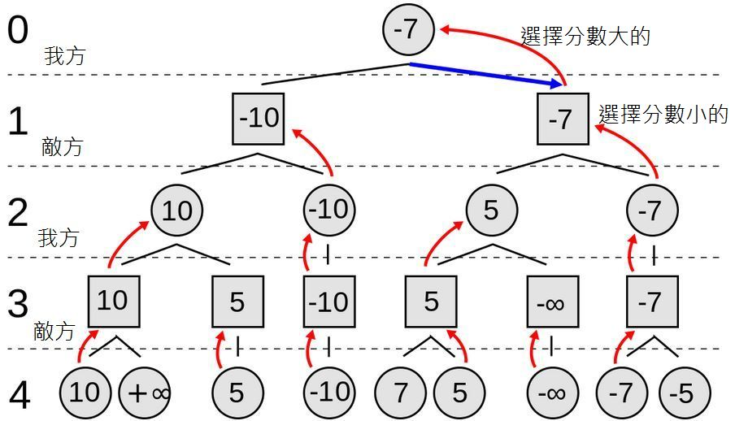

# 電腦下棋 — 五子棋
## 盤面評估函數
需要計算自己的連線分數、敵方的連線分數<br>
五子棋程式:[gomoku.py](01-gomoku/gomoku.py)
```
執行結果(人VS電腦):
C:\Users\user\Desktop\ai\ai109b\0415\01-gomoku>python gomoku.py P C
  0 1 2 3 4 5 6 7 8 9 a b c d e f
0 - - - - - - - - - - - - - - - - 0
1 - - - - - - - - - - - - - - - - 1
2 - - - - - - - - - - - - - - - - 2
3 - - - - - - - - - - - - - - - - 3
4 - - - - - - - - - - - - - - - - 4
5 - - - - - - - - - - - - - - - - 5
6 - - - - - - - - - - - - - - - - 6
7 - - - - - - - - - - - - - - - - 7
8 - - - - - - - - - - - - - - - - 8
9 - - - - - - - - - - - - - - - - 9
a - - - - - - - - - - - - - - - - a
b - - - - - - - - - - - - - - - - b
c - - - - - - - - - - - - - - - - c
d - - - - - - - - - - - - - - - - d
e - - - - - - - - - - - - - - - - e
f - - - - - - - - - - - - - - - - f
  0 1 2 3 4 5 6 7 8 9 a b c d e f
將 o 下在: 88
  0 1 2 3 4 5 6 7 8 9 a b c d e f
0 - - - - - - - - - - - - - - - - 0
1 - - - - - - - - - - - - - - - - 1
2 - - - - - - - - - - - - - - - - 2
3 - - - - - - - - - - - - - - - - 3
4 - - - - - - - - - - - - - - - - 4
5 - - - - - - - - - - - - - - - - 5
6 - - - - - - - - - - - - - - - - 6
7 - - - - - - - - - - - - - - - - 7
8 - - - - - - - - o - - - - - - - 8
9 - - - - - - - - - - - - - - - - 9
a - - - - - - - - - - - - - - - - a
b - - - - - - - - - - - - - - - - b
c - - - - - - - - - - - - - - - - c
d - - - - - - - - - - - - - - - - d
e - - - - - - - - - - - - - - - - e
f - - - - - - - - - - - - - - - - f
  0 1 2 3 4 5 6 7 8 9 a b c d e f

  0 1 2 3 4 5 6 7 8 9 a b c d e f
0 - - - - - - - - - - - - - - - - 0
1 - - - - - - - - - - - - - - - - 1
2 - - - - - - - - - - - - - - - - 2
3 - - - - - - - - - - - - - - - - 3
4 - - - - - - - - - - - - - - - - 4
5 - - - - - - - - - - - - - - - - 5
6 - - - - - - - - - - - - - - - - 6
7 - - - - - - - - - - - - - - - - 7
8 - - - - - - - - o x - - - - - - 8
9 - - - - - - - - - - - - - - - - 9
a - - - - - - - - - - - - - - - - a
b - - - - - - - - - - - - - - - - b
c - - - - - - - - - - - - - - - - c
d - - - - - - - - - - - - - - - - d
e - - - - - - - - - - - - - - - - e
f - - - - - - - - - - - - - - - - f
  0 1 2 3 4 5 6 7 8 9 a b c d e f
將 o 下在: 77
  0 1 2 3 4 5 6 7 8 9 a b c d e f
0 - - - - - - - - - - - - - - - - 0
1 - - - - - - - - - - - - - - - - 1
2 - - - - - - - - - - - - - - - - 2
3 - - - - - - - - - - - - - - - - 3
4 - - - - - - - - - - - - - - - - 4
5 - - - - - - - - - - - - - - - - 5
6 - - - - - - - - - - - - - - - - 6
7 - - - - - - - o - - - - - - - - 7
8 - - - - - - - - o x - - - - - - 8
9 - - - - - - - - - - - - - - - - 9
a - - - - - - - - - - - - - - - - a
b - - - - - - - - - - - - - - - - b
c - - - - - - - - - - - - - - - - c
d - - - - - - - - - - - - - - - - d
e - - - - - - - - - - - - - - - - e
f - - - - - - - - - - - - - - - - f
  0 1 2 3 4 5 6 7 8 9 a b c d e f

  0 1 2 3 4 5 6 7 8 9 a b c d e f
0 - - - - - - - - - - - - - - - - 0
1 - - - - - - - - - - - - - - - - 1
2 - - - - - - - - - - - - - - - - 2
3 - - - - - - - - - - - - - - - - 3
4 - - - - - - - - - - - - - - - - 4
5 - - - - - - - - - - - - - - - - 5
6 - - - - - - - - - - - - - - - - 6
7 - - - - - - - o - - - - - - - - 7
8 - - - - - - - - o x - - - - - - 8
9 - - - - - - - - - x - - - - - - 9
a - - - - - - - - - - - - - - - - a
b - - - - - - - - - - - - - - - - b
c - - - - - - - - - - - - - - - - c
d - - - - - - - - - - - - - - - - d
e - - - - - - - - - - - - - - - - e
f - - - - - - - - - - - - - - - - f
  0 1 2 3 4 5 6 7 8 9 a b c d e f
將 o 下在: 79
  0 1 2 3 4 5 6 7 8 9 a b c d e f
0 - - - - - - - - - - - - - - - - 0
1 - - - - - - - - - - - - - - - - 1
2 - - - - - - - - - - - - - - - - 2
3 - - - - - - - - - - - - - - - - 3
4 - - - - - - - - - - - - - - - - 4
5 - - - - - - - - - - - - - - - - 5
6 - - - - - - - - - - - - - - - - 6
7 - - - - - - - o - o - - - - - - 7
8 - - - - - - - - o x - - - - - - 8
9 - - - - - - - - - x - - - - - - 9
a - - - - - - - - - - - - - - - - a
b - - - - - - - - - - - - - - - - b
c - - - - - - - - - - - - - - - - c
d - - - - - - - - - - - - - - - - d
e - - - - - - - - - - - - - - - - e
f - - - - - - - - - - - - - - - - f
  0 1 2 3 4 5 6 7 8 9 a b c d e f
(以下省略)
```

## 提升電腦的棋力
### Min-Max 對局搜尋法
要提升棋力通常必須採用「Min-Max 對局搜尋法」，如果能夠搜尋得愈深，電腦的棋力通常就會越高。<br>
Min-Max 對局搜尋法是依照「讓自己得分最多，且讓對手得分最少」的想法設計的。<br>
我們將所有層次分為「敵我雙方」兩類，我方下的那層得分越多越好，而對方下的那層失分越少越好。<br>
而且在每一層上都必須認為「對方可能會下出讓我們失分最多的一步」，而我們必須盡可能選擇「最大失分最小化」的策略，因此就導出了「Min-Max 對局搜尋法」。<br>
<br>
圖中第 0 層代表我方，所以取在第一層失分少(分數大的)的步驟，而第 1 層代表敵方，所以假設他會採取對他最有利的下法 (也就是讓我們失分多的(分數小的))。<br>
### Alpha-Beta 修剪法
Alpha-Beta 修剪法 是「Min-Max 對局搜尋法」的一個修改版，在 Min-Max 當中加入了 α 與 β 兩個紀錄值，用來做為是否要修剪的參考標準。<br>
<br>

