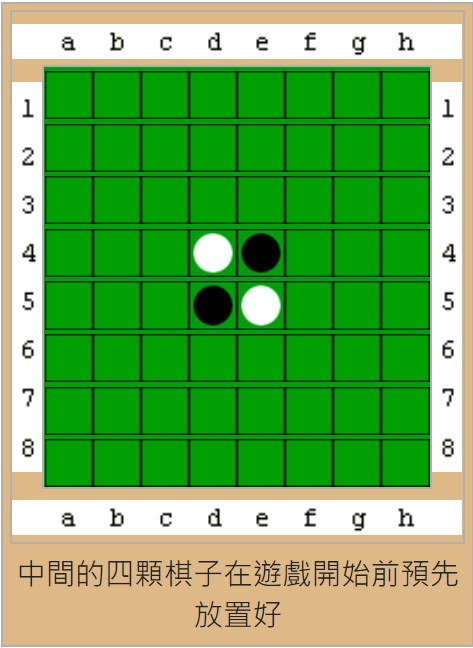
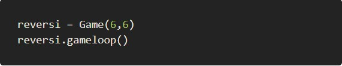
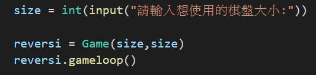
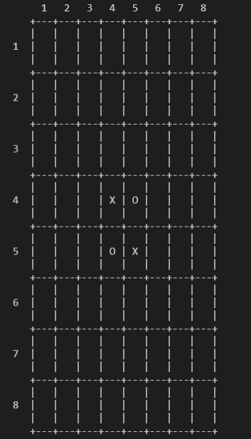
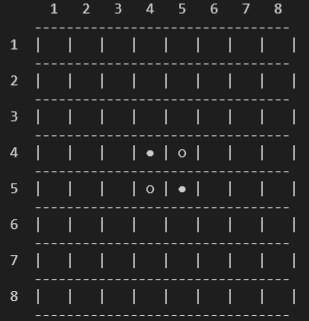
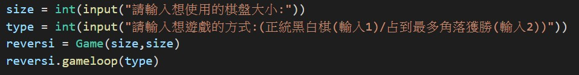

# 黑白棋

本程式修改自[【人機對戰】用python打造經典黑白棋遊戲](https://ithelp.ithome.com.tw/articles/10232227)的程式碼

## 黑白棋簡介
### 棋具
棋子：黑白棋棋子每顆由黑白兩色組成，一面白，一面黑，共64個（包括棋盤中央的4個）。棋子呈圓餅形。<br>
棋盤：黑白棋棋盤由64格的正方格組成，遊戲進行時棋子要下在格內。棋盤可分為「角」、「邊」以及「中腹」。現今的棋盤多以8x8較為普遍。<br>
### 規則
棋盤共有8行8列。<br>
開局時，棋盤正中央的4格先置放黑白相隔的4枚棋子。通常黑子先行。<br>
<br>
雙方輪流落子。只要落子和棋盤上任一枚己方的棋子在一條線上（橫、直、斜線皆可）夾著對方棋子，就能將對方的這些棋子轉變為己方棋子（翻面即可）。<br>
如果在任一位置落子都不能夾住對手的任一顆棋子，就要讓對手下子。<br>
當雙方皆不能下子時，遊戲就結束，子多的一方勝。<br>
### 遊戲策略
因為黑白棋在遊戲後期可能僅用幾個回合就將大量對方棋子變成己方，從而扭轉局勢。<br>
因此最重要的是占據有利位置。<br>
中間位置的棋子最容易受到夾擊，有橫、直、斜線共四個方向的可能。<br>
而邊緣的棋子則只有一個可能被夾擊的方向，當四個角落上的位置被占據後，則完全不可能被攻擊，所以在遊戲時要盡力佔據邊緣的位置。<br>

## 對程式進行修改
### 讓使用者可以控制棋盤大小
原本的程式碼將棋盤大小寫在程式中，如下圖:<br>
<br>
我希望使用者在遊戲時可以直接輸入自己想要的棋盤大小，所以將程式碼進行修改，如下圖:<br>
<br>
### 修改棋盤外觀
原本的棋盤:<br>
<br>
修改後的棋盤:<br>
<br>
### 增加新的遊戲方式
原本的程式碼中只有正統的黑白棋玩法。
我在裡面加了另一種計分方式，只計算佔領的角落數量，數量多的獲勝。<br>
在執行程式時可以選擇想要的遊戲方式:<br>
<br>
計算佔領的角落數量的程式碼如下:<br>
```
# 計算當前比分(佔領的角落數量)
    def getScoreOfCorner(self)-> dict:
        scores = {'●':0, '○':0}
        if self.board[0][0] == '●':
            scores['●'] += 1
        if self.board[0][self.width-1] == '●':
            scores['●'] += 1
        if self.board[self.width-1][0] == '●':
            scores['●'] += 1
        if self.board[self.width-1][self.width-1] == '●':
            scores['●'] += 1
        if self.board[0][0] == '○':
            scores['○'] += 1
        if self.board[0][self.width-1] == '○':
            scores['○'] += 1
        if self.board[self.width-1][0] == '○':
            scores['○'] += 1
        if self.board[self.width-1][self.width-1] == '○':
            scores['○'] += 1
        return scores
```
顯示目前分數的程式碼如下:<br>
```
# 顯示目前比分(佔領的角落數量)
    def showPointsCorner(self, playerTile, computerTile):
        scores = self.getScoreOfCorner()
        print(f'You have {scores[playerTile]} points. The computer has {scores[computerTile]} points.')
```
正統黑白棋的結束遊戲條件是雙方都無法行動，而佔領角落的模式會有幾個可以提前結束遊戲的條件:
1. 其中一方已經佔到三個角落就結束遊戲。
2. 雙方各佔領2個角落(平手)就結束遊戲。
定義結束遊戲條件的程式碼:<br>
```
# 若無人可行動，結束遊戲
if not playerValidMoves and not computerValidMoves:
    break
if type == 2: # 在佔領角落模式時需額外檢查的結束遊戲條件
    scoresC = self.getScoreOfCorner()
    if scoresC['○'] >= 3 or scoresC['●'] >= 3:
        break # 其中一方佔到三個角落就結束遊戲
    elif scoresC['○'] == 2 and scoresC['●'] == 2:
        break # 雙方各佔領2個角落(平手)就結束遊戲
```

## 執行結果 (以6*6棋盤為例)
執行結果中 ● 代表 自己，○ 代表電腦，√ 代表可以下的合法棋步。<br>
### 正統黑白棋
執行結果:
1. [正統黑白棋WIN](result/resultOW.txt)
2. [正統黑白棋LOSE](result/resultOL.txt)
### 佔領角落模式
執行結果:
1. [佔領角落WIN](result/resultCW.txt)
2. [佔領角落LOSE](result/resultCL.txt)
3. [佔領角落平手](result/resultC.txt)
## 參考資料
1. [黑白棋- 维基百科，自由的百科全书](https://zh.wikipedia.org/wiki/%E9%BB%91%E7%99%BD%E6%A3%8B)
2. [【人機對戰】用python打造經典黑白棋遊戲](https://ithelp.ithome.com.tw/articles/10232227)