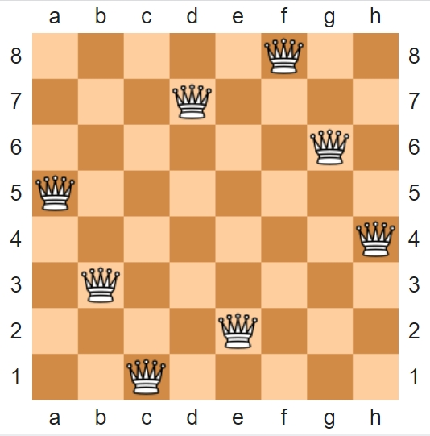
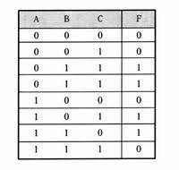

# 八皇后問題
一個以西洋棋為背景的問題：如何在8×8的棋盤上放置八個皇后，使得任何一個皇后都無法直接吃掉其他的皇后？<br>
為了達到目的，任兩個皇后都不能處於同一條橫行、縱行或斜線上。<br>
<br>

印出所有排列:[permutation.py](02-queen/permutation.py)<br>
執行結果中印出2個數字(0、1)及3個數字(0、1、2)的所有排列<br>
```
執行結果:
C:\Users\user\Desktop\ai\ai109b\0325\02-queen>python permutation.py
[0, 0]
[0, 1]
[1, 0]
[1, 1]
[0, 0, 0]
[0, 0, 1]
[0, 0, 2]
[0, 1, 0]
[0, 1, 1]
[0, 1, 2]
[0, 2, 0]
[0, 2, 1]
[0, 2, 2]
[1, 0, 0]
[1, 0, 1]
[1, 0, 2]
[1, 1, 0]
[1, 1, 1]
[1, 1, 2]
[1, 2, 0]
[1, 2, 1]
[1, 2, 2]
[2, 0, 0]
[2, 0, 1]
[2, 0, 2]
[2, 1, 0]
[2, 1, 1]
[2, 1, 2]
[2, 2, 0]
[2, 2, 1]
[2, 2, 2]
```
八皇后問題:[queen.py](02-queen/queen.py)<br>
執行結果中印出2個皇后及8個皇后的所有解<br>
其中的[1,3,0,2] 代表
    x=[1,3,0,2]
    y=[0,1,2,3] 
    畫成棋盤:
        x  Q  x  x  
        x  x  x  Q 
        Q  x  x  x 
        x  x  Q  x  
```
執行結果:
C:\Users\user\Desktop\ai\ai109b\0325\02-queen>python queen.py
[1, 3, 0, 2]
[2, 0, 3, 1]
[0, 4, 7, 5, 2, 6, 1, 3]
[0, 5, 7, 2, 6, 3, 1, 4]
[0, 6, 3, 5, 7, 1, 4, 2]
[0, 6, 4, 7, 1, 3, 5, 2]
[1, 3, 5, 7, 2, 0, 6, 4]
[1, 4, 6, 0, 2, 7, 5, 3]
[1, 4, 6, 3, 0, 7, 5, 2]
[1, 5, 0, 6, 3, 7, 2, 4]
[1, 5, 7, 2, 0, 3, 6, 4]
[1, 6, 2, 5, 7, 4, 0, 3]
[1, 6, 4, 7, 0, 3, 5, 2]
[1, 7, 5, 0, 2, 4, 6, 3]
[2, 0, 6, 4, 7, 1, 3, 5]
[2, 4, 1, 7, 0, 6, 3, 5]
[2, 4, 1, 7, 5, 3, 6, 0]
[2, 4, 6, 0, 3, 1, 7, 5]
[2, 4, 7, 3, 0, 6, 1, 5]
[2, 5, 1, 4, 7, 0, 6, 3]
[2, 5, 1, 6, 0, 3, 7, 4]
[2, 5, 1, 6, 4, 0, 7, 3]
[2, 5, 3, 0, 7, 4, 6, 1]
[2, 5, 3, 1, 7, 4, 6, 0]
[2, 5, 7, 0, 3, 6, 4, 1]
[2, 5, 7, 0, 4, 6, 1, 3]
[2, 5, 7, 1, 3, 0, 6, 4]
[2, 6, 1, 7, 4, 0, 3, 5]
[2, 6, 1, 7, 5, 3, 0, 4]
[2, 7, 3, 6, 0, 5, 1, 4]
[3, 0, 4, 7, 1, 6, 2, 5]
[3, 0, 4, 7, 5, 2, 6, 1]
[3, 1, 4, 7, 5, 0, 2, 6]
[3, 1, 6, 2, 5, 7, 0, 4]
[3, 1, 6, 2, 5, 7, 4, 0]
[3, 1, 6, 4, 0, 7, 5, 2]
[3, 1, 7, 4, 6, 0, 2, 5]
[3, 1, 7, 5, 0, 2, 4, 6]
[3, 5, 0, 4, 1, 7, 2, 6]
[3, 5, 7, 1, 6, 0, 2, 4]
[3, 5, 7, 2, 0, 6, 4, 1]
[3, 6, 0, 7, 4, 1, 5, 2]
[3, 6, 2, 7, 1, 4, 0, 5]
[3, 6, 4, 1, 5, 0, 2, 7]
[3, 6, 4, 2, 0, 5, 7, 1]
[3, 7, 0, 2, 5, 1, 6, 4]
[3, 7, 0, 4, 6, 1, 5, 2]
[3, 7, 4, 2, 0, 6, 1, 5]
[4, 0, 3, 5, 7, 1, 6, 2]
[4, 0, 7, 3, 1, 6, 2, 5]
[4, 0, 7, 5, 2, 6, 1, 3]
[4, 1, 3, 5, 7, 2, 0, 6]
[4, 1, 3, 6, 2, 7, 5, 0]
[4, 1, 5, 0, 6, 3, 7, 2]
[4, 1, 7, 0, 3, 6, 2, 5]
[4, 2, 0, 5, 7, 1, 3, 6]
[4, 2, 0, 6, 1, 7, 5, 3]
[4, 2, 7, 3, 6, 0, 5, 1]
[4, 6, 0, 2, 7, 5, 3, 1]
[4, 6, 0, 3, 1, 7, 5, 2]
[4, 6, 1, 3, 7, 0, 2, 5]
[4, 6, 1, 5, 2, 0, 3, 7]
[4, 6, 1, 5, 2, 0, 7, 3]
[4, 6, 3, 0, 2, 7, 5, 1]
[4, 7, 3, 0, 2, 5, 1, 6]
[4, 7, 3, 0, 6, 1, 5, 2]
[5, 0, 4, 1, 7, 2, 6, 3]
[5, 1, 6, 0, 2, 4, 7, 3]
[5, 1, 6, 0, 3, 7, 4, 2]
[5, 2, 0, 6, 4, 7, 1, 3]
[5, 2, 0, 7, 3, 1, 6, 4]
[5, 2, 0, 7, 4, 1, 3, 6]
[5, 2, 4, 6, 0, 3, 1, 7]
[5, 2, 4, 7, 0, 3, 1, 6]
[5, 2, 6, 1, 3, 7, 0, 4]
[5, 2, 6, 1, 7, 4, 0, 3]
[5, 2, 6, 3, 0, 7, 1, 4]
[5, 3, 0, 4, 7, 1, 6, 2]
[5, 3, 1, 7, 4, 6, 0, 2]
[5, 3, 6, 0, 2, 4, 1, 7]
[5, 3, 6, 0, 7, 1, 4, 2]
[5, 7, 1, 3, 0, 6, 4, 2]
[6, 0, 2, 7, 5, 3, 1, 4]
[6, 1, 3, 0, 7, 4, 2, 5]
[6, 1, 5, 2, 0, 3, 7, 4]
[6, 2, 0, 5, 7, 4, 1, 3]
[6, 2, 7, 1, 4, 0, 5, 3]
[6, 3, 1, 4, 7, 0, 2, 5]
[6, 3, 1, 7, 5, 0, 2, 4]
[6, 4, 2, 0, 5, 7, 1, 3]
[7, 1, 3, 0, 6, 4, 2, 5]
[7, 1, 4, 2, 0, 6, 3, 5]
[7, 2, 0, 5, 1, 4, 6, 3]
[7, 3, 0, 2, 5, 1, 6, 4]
```
# 真值表
<br>
真值表是一種用於邏輯（特別是邏輯代數、布林函數和命題邏輯上）的數學用表，用來計算邏輯表示式在每種論證（即每種邏輯變數取值的組合）上的值。<br>
真值表可以用來判斷一個命題表示式是否對所有允許的輸入值皆為真，亦即是否為邏輯有效的。<br>
真值表[truthtable.py](02-queen/truthtable.py)
```
執行結果:
C:\Users\user\Desktop\ai\ai109b\0325\02-queen>python truthtable.py
[0, 0, 0]
[0, 0, 1]
[0, 1, 0]
[0, 1, 1]
[1, 0, 0]
[1, 0, 1]
[1, 1, 0]
[1, 1, 1]
```