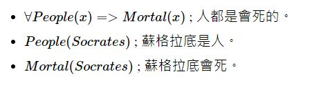
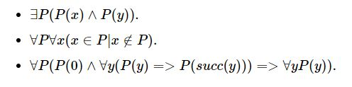
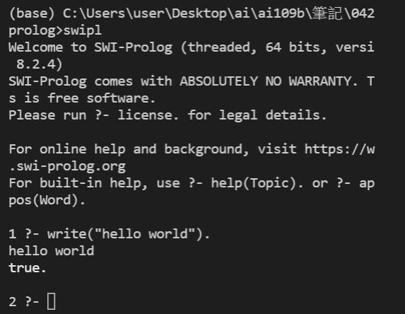
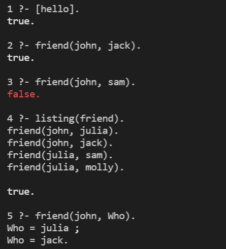

# 迪摩根定理(De Morgan's laws)
1. -(x｜ y) = -x & -y
2. -(x & y) = -x｜-y
# 謂詞邏輯 (Predicate Logic)
布林邏輯中，只有用來代表真假值的簡單變數，像是 A, B, C, X, Y, Z .... 等，所以邏輯算式看來通常如下:<br>
```
P & (P=>Q) => Q.
A & B & C => D | E.
-(A & B) <=> -A | -B.
```
《謂詞邏輯》(Predicate logic) 裏，則有「布林函數」的概念，因此其表達能力較強，例如以下是一些謂詞邏輯的範例。<br>
```
Parent(x,y) <= Father(x,y).
Parent(John, Johnson).
Ancestor(x,y) <= Parent(x,y).
Ancestor(x,y) <= Ancestor(x,z) & Parent(z,y).
```
# 一階邏輯(First-Order Logic)
在上述這種謂詞邏輯系統中，如果我們加上∀(對於所有)或∃(存在)這兩個變數限定符號，而其中的謂詞不可以是變項，而必須要是常項，這種邏輯就稱為一階邏輯。<br>
<br>
# 二階邏輯 (Second-Order Logic)
如果一階邏輯中的謂詞，放寬成可以是變項的話 (這些變項可以加上 ∀ 與 ∃ 等符號的約束)，那就變成了二階邏輯，以下是一些二階邏輯的規則範例。<br>

# 邏輯推論實作
## 布林邏輯的推論引擎
程式碼 [kbTest.py](kbTest.py)<br>
```
執行結果:
C:\Users\user\Desktop\ai\ai109b\筆記\0429>python kbTest.py
['A<=B', 'B<=C&D', 'C<=E', 'D<=F', 'E', 'F', 'Z<=C&D&G', '']
rule:head=A terms=['B']
rule:head=B terms=['C', 'D']
rule:head=C terms=['E']
rule:head=D terms=['F']
rule:head=E terms=
rule:head=F terms=
rule:head=Z terms=['C', 'D', 'G']
addFact(E)
addFact(F)
addFact(C)
addFact(D)
addFact(B)
addFact(A)
facts= dict_keys(['E', 'F', 'C', 'D', 'B', 'A'])   
```
# 專家系統 - 前向推論程式
[animal_ostrich.kb](animal_ostrich.kb)是一個代表鴕鳥的動物世界規則庫。<br>
[kbReason.py](kbReason.py)是透過讀入規則檔並進行前向推論的程式。<br>
此程式的執行指令為python kbReason.py animal_ostrich.kb<br>
```
執行結果:
C:\Users\user\Desktop\ai\ai109b\筆記\0429>python kbReason.py animal_ostrich.kb
['哺乳類 <= 有毛', '\n哺乳類 <= 泌乳', '\n鳥類   <= 有 
羽毛', '\n鳥類   <= 會飛 & 生蛋', '\n食肉類 <= 哺乳類 & 吃肉', '\n食肉類 <= 有爪 & 利齒 & 兩眼前視', '\n有蹄類
 <= 哺乳類 & 有蹄', '\n偶蹄類 <= 哺乳類 & 反芻', '\n獵 
豹   <= 哺乳類 & 吃肉 & 斑點', '\n老虎   <= 哺乳類 & 吃
肉 & 條紋', '\n長頸鹿 <= 有蹄類 & 長腿 & 斑點', '\n斑馬
   <= 有蹄類 & 條紋', '\n鴕鳥   <= 鳥類 & 長腿', '\n\n 
會飛', '\n生蛋', '\n長腿', '']
rule:head=哺乳類 terms=['有毛']
rule:head=哺乳類 terms=['泌乳']
rule:head=鳥類 terms=['有羽毛']
rule:head=鳥類 terms=['會飛 ', ' 生蛋']
rule:head=食肉類 terms=['哺乳類 ', ' 吃肉']
rule:head=食肉類 terms=['有爪 ', ' 利齒 ', ' 兩眼前視']rule:head=有蹄類 terms=['哺乳類 ', ' 有蹄']
rule:head=偶蹄類 terms=['哺乳類 ', ' 反芻']
rule:head=獵豹 terms=['哺乳類 ', ' 吃肉 ', ' 斑點']    
rule:head=老虎 terms=['哺乳類 ', ' 吃肉 ', ' 條紋']    
rule:head=長頸鹿 terms=['有蹄類 ', ' 長腿 ', ' 斑點']  
rule:head=斑馬 terms=['有蹄類 ', ' 條紋']
rule:head=鴕鳥 terms=['鳥類 ', ' 長腿']
rule:head=會飛 terms=
rule:head=生蛋 terms=
rule:head=長腿 terms=
addFact(會飛)
addFact(生蛋)
addFact(長腿)
addFact(鳥類)
addFact(鴕鳥)
facts= dict_keys(['會飛', '生蛋', '長腿', '鳥類', '鴕鳥'])
```
這個系統利用了規則庫中包含的「會飛. 生蛋. 長腿. 」推論出了鴕鳥的結果。<br>
# 專家系統 - 互動推論程式
除了將「隱含前提」直接寫死在規則庫當中，我們也可以透過互動的方式讓使用者輸入這些「隱含前提」，逐步的讓「推理引擎」推論出結果，以下是這種互動式推論的一個執行範例。<br>
[animal.kb](animal.kb)是一個動物世界規則庫。<br>
[kbQuery.py](kbQuery.py)是一個通用的推論程式。<br>
此程式的執行指令為python kbQuery.py animal.kb
```
執行結果:
C:\Users\user\Desktop\ai\ai109b\筆記\0429python kbQuery.py animal.kb
['哺乳類 <= 有毛', '\n哺乳類 <= 泌乳', '\n鳥類   
<= 有羽毛', '\n鳥類   <= 會飛 & 生蛋', '\n食肉類 
<= 哺乳類 & 吃肉', '\n食肉類 <= 有爪 & 利齒 & 兩 
眼前視', '\n有蹄類 <= 哺乳類 & 有蹄', '\n偶蹄類 <= 哺乳類 & 反芻', '\n獵豹   <= 哺乳類 & 吃肉 & 斑
點', '\n老虎   <= 哺乳類 & 吃肉 & 條紋', '\n長頸 
鹿 <= 有蹄類 & 長腿 & 斑點', '\n斑馬   <= 有蹄類 
& 條紋', '\n鴕鳥   <= 鳥類 & 長腿', '']
rule:head=哺乳類 terms=['有毛']
rule:head=哺乳類 terms=['泌乳']
rule:head=鳥類 terms=['有羽毛']
rule:head=鳥類 terms=['會飛 ', ' 生蛋']
rule:head=食肉類 terms=['哺乳類 ', ' 吃肉']      
rule:head=食肉類 terms=['有爪 ', ' 利齒 ', ' 兩眼
前視']
rule:head=有蹄類 terms=['哺乳類 ', ' 有蹄']      
rule:head=偶蹄類 terms=['哺乳類 ', ' 反芻']      
rule:head=獵豹 terms=['哺乳類 ', ' 吃肉 ', ' 斑點
']
rule:head=老虎 terms=['哺乳類 ', ' 吃肉 ', ' 條紋
']
rule:head=長頸鹿 terms=['有蹄類 ', ' 長腿 ', ' 斑
點']
rule:head=斑馬 terms=['有蹄類 ', ' 條紋']        
rule:head=鴕鳥 terms=['鳥類 ', ' 長腿']
facts= dict_keys([])
?-哺乳類
addFact(哺乳類)
facts= dict_keys(['哺乳類'])
?-有蹄
addFact(有蹄)
addFact(有蹄類)
facts= dict_keys(['哺乳類', '有蹄', '有蹄類'])
?-斑點
addFact(斑點)
facts= dict_keys(['哺乳類', '有蹄', '有蹄類', '斑
點'])
?-長腿
addFact(長腿)
addFact(長頸鹿)
facts= dict_keys(['哺乳類', '有蹄', '有蹄類', '斑點', '長腿', '長頸鹿'])
```
這個系統利用我們輸入的「哺乳類. 有蹄. 斑點. 長腿.」推論出了長頸鹿的結果。<br>
# prolog
## prolog 簡介
Prolog是一種與眾不同的語言，不用來開發軟件，專門解決邏輯問題。<br>
他是"邏輯編程"（programming of Logic）的意思。只要給出事實和規則，它會自動分析其中的邏輯關係，然後允許用戶通過查詢，完成複雜的邏輯運算。<br>
## 使用prolog
1. 安裝 : choco install swi-prolog
2. 呼叫prolog : swipl
3. 輸入指令:write("hello world").
以上的指令輸入後的結果:<br>

※ Prolog所有語句的結尾都用一個"點"（.）表示結束。
4. 退出prolog : halt.
## 查詢已經設定的條件
1. 先寫一個腳本[hello.pl](prolog/hello.pl)紀錄兩個對象之間的關係。
2. 加載 hello.pl，指令 : [hello].
3. 查詢兩個人是否為朋友，指令 : friend(john,jack).
4. 列出所有的朋友關係，指令 : listing(friend).
5. 查詢john有多少個朋友，指令 : friend(john, Who).
※ 結果不只一個，輸入分號(;)就可以看到第二個結果。<br>
以上的指令輸入後的結果:<br>

## 利用prolog執行八皇后問題
1. 加載 [nqueens.pl](nqueens.pl)，指令 : [nqueens.pl].
2. 執行四皇后問題，指令 : nqueens(4,Qs).
3. 執行八皇后問題，指令 : nqueens(4,Qs).
以上的指令輸入後的結果:<br>
```
6 ?- [nqueens].
true.

7 ?- nqueens(4,Qs).
Correct to: "queens(4,Qs)"? yes
Qs = [[2, 4, 1, 3], [3, 1, 4, 2]].

8 ?- nqueens(8,Qs).
Correct to: "queens(8,Qs)"? yes
Qs = [[1, 5, 8, 6, 3, 7, 2, 4], [1, 6, 8, 3, 7, 4, 2|...], [1, 7, 4, 6, 8, 2|...], [1, 7, 5, 8, 2|...], [2, 4, 6, 8|...], [2, 5, 7|...], [2, 5|...], [2|...], [...|...]|...].
```
# 參考資料
[Prolog 语言入门教程- 阮一峰的网络日志](http://www.ruanyifeng.com/blog/2019/01/prolog.html)