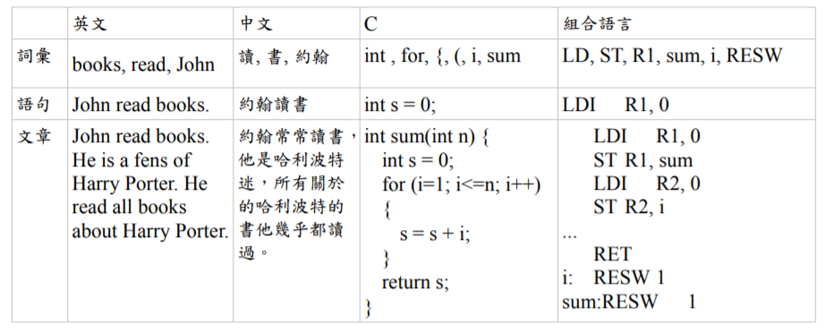
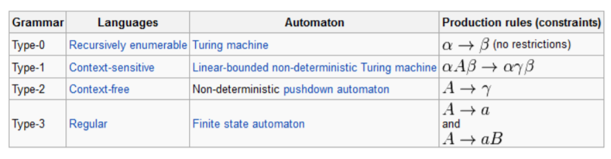
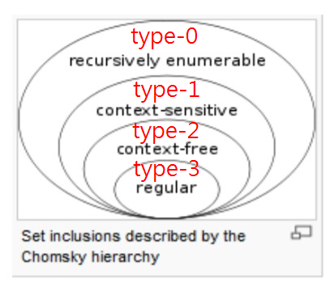

# 語言處理
## 自然語言
由歷史過程中衍生出的語言就稱為自然語言，像是中文、日文、英文等。<br>
由某人從無到有所創造設計的，像是C語言、Python等程式語言就稱為人造語言。<br>
還有一種語言是將前兩者混和的語言，通常被稱為標記語言，像是HTML、Markdown等。<br>
## 語言的處理
電腦對程式語言的處理方法已經相當成熟，編譯器可以容易地將高階程式語言轉換成組合語言或機器碼。<br>
但是目前的技術對自然語言的處理比較力不從心，雖然機器翻譯的品質改進了很多，但還是難以達到人類的翻譯水準。<br>
## 語言的意義
<br>
將各個層次分開處理，那麼語言的處理就可以分為：<br>

1. 詞彙掃描 : 詞彙層次
2. 語法剖析 : 語句層次
3. 語意解析 : 文章層次
4. 語言合成 : 回應階段，將《詞彙》組合成《語句》、再將《語句》組合成《文章》呈現出來！

## Chomsky Hierarchy (喬姆斯基語言階層）
<br>
上圖中，α、β可以是任何語句，而 A, B 代表只能是非終端符號，a 只能是終端符號。<br>
Type-0 的語言描述力是最強的，基本上任何的語法規則您都可以撰寫而毫無限制，這種語言所能描述的語言稱為「遞歸可枚舉語言」 (Recursive Enumerable , RE)。<br>
Type-1 語言的語法有點限制，因為每個規則的左邊至少要有一個非終端項目 A，這種語法所能描述的語言稱為「對上下文敏感的語言」 (Context-Sensitive)。<br>
Type-2 語言的語法限制更大，因為規則左邊只能有一個非終端項目 (以 A 代表)，規則右邊則沒有限制，這種語言被稱為「上下文無關的語言」。<br>
Type-3 的語法限制是最多的，其規則的左右兩邊都最多只能有一個非終端項目 (以 A, B 表示) ，而且右端的終端項目 (以 a 表示) 只能放在非終端項目 B 的前面。這種語言稱為「正規式」(Regular)。<br>
下圖是這些語言階層之間的包含關係:<br>
<br>
## 逐字翻譯程式
[逐字翻譯程式](e2c.py)
執行指令 : python e2c.py a dog chase a cat<br>
後面的句子可以改成別的，像是 that cat eat the dog。<br>
```
執行結果:
C:\Users\user\Desktop\ai\ai109b\筆 
記\0513>python e2c.py a dog chase a cat   
['一隻', '狗', '追', '一隻', '貓']        

C:\Users\user\Desktop\ai\ai109b\筆 
記\0513>python e2c.py that cat eat the dog
['那隻', '貓', '吃', '這隻', '狗']
```
## 產生語句
### 程式實作
[產生中文語句](gen_chinese2.py)
執行指令 : python gen_chinese2.py<br>
執行後程式會隨機產生中文語句。<br>
```
執行結果:
C:\Users\user\Desktop\ai\ai109b\筆記\0513>python gen_chinese2.py
一隻 兇 狗 追 一隻  貓

C:\Users\user\Desktop\ai\ai109b\筆記\0513>python gen_chinese2.py
一隻  狗 追 一隻 帥 兇 兇 貓

C:\Users\user\Desktop\ai\ai109b\筆記\0513>python gen_chinese2.py
一隻  狗 吃 這隻  貓

C:\Users\user\Desktop\ai\ai109b\筆記\0513>python gen_chinese2.py
一隻  貓 追 這隻 黑 帥 貓
```
[產生英文語句](gen_chinese2.py)
執行指令 : python gen_english1.py<br>
執行後程式會隨機產生英文語句。<br>
```
執行結果:
C:\Users\user\Desktop\ai\ai109b\筆記\0513>python gen_english1.py
the cat eat the dog

C:\Users\user\Desktop\ai\ai109b\筆記\0513>python gen_english1.py
a dog eat a cat

C:\Users\user\Desktop\ai\ai109b\筆記\0513>python gen_english1.py
the dog eat the cat

C:\Users\user\Desktop\ai\ai109b\筆記\0513>python gen_english1.py
the dog chase a cat
```
[產生合法運算式](gen_exp1.py)
執行指令 : python gen_exp1.py<br>
執行後程式會隨機產生合法運算式。<br>
```
執行結果:
C:\Users\user\Desktop\ai\ai109b\筆記\0513>python gen_exp1.py
8 = 8

C:\Users\user\Desktop\ai\ai109b\筆記\0513>python gen_exp1.py
2+3/6/3-9 = -6.833333333333334

C:\Users\user\Desktop\ai\ai109b\筆記\0513>python gen_exp1.py
6+7*1+8-9+7-1*5 = 14

C:\Users\user\Desktop\ai\ai109b\筆記\0513>python gen_exp1.py
9-3+5 = 11
```