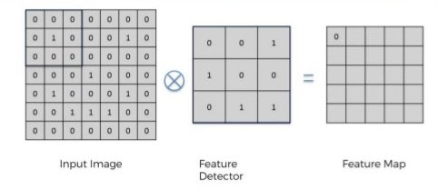

# 人工智慧的方法
人工智慧的方法可以分成5種:<br>
1. 比對法:紀錄問題與答案配對後，直接從表格內查出，像是Elisa交談系統。
2. 推理法:撰寫規則後，電腦根據規則推論，像是專家系統。
3. 搜尋法:對所有可能的結果進行系統式的列舉，然後看看有沒有答案，像是深度優先、廣度優先、拼圖、電腦下棋。
4. 統計法 :找出機率最大的解答，像是利用電腦亂數驗證中央極限定理，語音辨識及機器翻譯系統也都是使用統計法。
5. 優化法對每個可能的解答，都給一個分數及權重，找出總分最好的解答，像是爬山演算法、遺傳演算法。
# 神經元的開關函數
<br>
# 深度學習
深度學習的神經網路除了多層感知器之外，還加入了捲積神經網路CNN、循環神經網路RNN, LSTM、生成對抗網路GAN、強化學習機制。
## 捲積神經網路CNN
通常用來辨認影像。<br>
其中的捲積層是一種遮罩函數，檢查有沒有符合遮罩的點<br>
<br>
有些遮罩可以取出邊緣，有些可以區分深淺。<br>

## 循環神經網路RNN
最常被用來處理語言，像是機器翻譯系統。<br>
<br>
RNN的神經原有循環可以用來儲存一些狀態。相同的輸入不一定會有相同的輸出，因為和目前的狀態有關。<br>
但是簡單的RNN不穩定，只能記住短期的事情，所以有人發展出長短期記憶網路，簡稱為LSTM。<br>
<br>
## 生成對抗網路GAN
採用偽造者與鑑賞者的對抗模式，讓雙方在對抗的過程中能力越來越強。<br>
GAN擅長模仿他人的風格或是將素描轉換成擬真照片。<br>
<br>
## 強化學習機制
常常透過探索或自我對打找到好的策略來進行決策。<br>
像AlphaGo就是機率模型+強化學習+神經網路結合的結果。<br>

## 程式實作
[alexnet.py](alexnet.py)
執行前需要先執行指令:<br>
1. pip install torch。<br>
2. pip install models。<br>
3. pip install transforms。<br>
```
執行結果:
(base) C:\Users\user\Desktop\ai\ai109b\筆記\0527\01-classify> python alexnet.py
img_t.shape= torch.Size([3, 224, 224])
batch_t.shape= torch.Size([1, 3, 224, 224])
preds.shape= torch.Size([1, 1000])
Labrador retriever
```
[predict.py](predict.py)
```
執行結果:
(base) C:\Users\user\Desktop\ai\ai109b\筆記\0527\01-classify> python predict.py alexnet img/dog.jpg
img_t.shape= torch.Size([3, 224, 224])
batch_t.shape= torch.Size([1, 3, 224, 224])
preds.shape= torch.Size([1, 1000])
Labrador retriever

(base) C:\Users\user\Desktop\ai\ai109b\筆記\0527\01-classify> python predict.py alexnet img/cat.jpg
img_t.shape= torch.Size([3, 224, 224])
batch_t.shape= torch.Size([1, 3, 224, 224])
preds.shape= torch.Size([1, 1000])
Egyptian cat
```