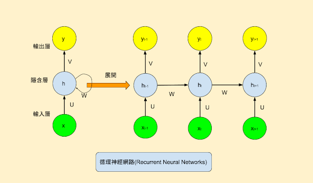
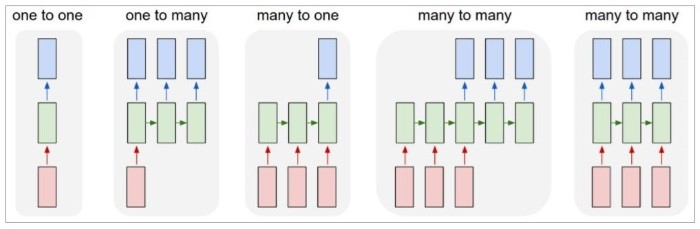

# colab
1. 可以在瀏覽器上撰寫及執行 Python
2. 不必進行任何設定
3. 免費使用 GPU
4. 輕鬆共用
# RNN
最常被用來處理語言。 
 
當前 output 不只受上一層輸入的影響，也受到同一層前一個 output 的影響(即前文) 

RNN可以有很多變化及應用: 
1. 一對一(one to one)：固定長度的輸入(input)及輸出(output)，即一般的 Neural Network 模型。
2. 一對多(one to many)：單一輸入、多個輸出，例如影像標題(Image Captioning)，輸入一個影像，希望偵測影像內多個物體，並一一給予標題。
3. 多對一(many to one)：多個輸入、單一輸出，例如情緒分析(Sentiment Analysis)，輸入一大段話，判斷這段話是正面或負面的情緒表達。
4. 多對多(many to many)：多個輸入、多個輸出，例如語言翻譯(Machine Translation)，輸入一段英文句子，翻譯成中文。
5. 另一種多對多(many to many)：『同步』的多個輸入、多個輸出，例如視訊分類(Video Classification)，輸入一段影片，希望為每一幀(Frame)產生一個標題。  
下圖為這五種RNN模型: 
 
資料來源:[Day 14：循環神經網路(Recurrent Neural Network ... - iT 邦幫忙](https://ithelp.ithome.com.tw/articles/10193469)

# One-hot Encoding
One-hot在數位電路中被用來表示一種特殊的位元組合，該位元組裏，僅容許單一位元爲1，其他位元都必須爲0。 
之所以稱爲one-hot就是因爲只能有一個1（hot）。若情況相反，只有一個0，其餘爲1，則稱爲one-cold。 
在機器學習裏，也有one-hot向量（英語：one-hot vector）的概念。在一任意維度的向量中，僅有一個維度的值是1，其餘爲0。 
## 優缺點比較
### 優點:
1. 決定狀態機目前狀態的時間成本低，因爲讀取一個正反器的時間成本固定。
2. 改變機器的狀態所需時間成本也是固定，因爲每次只需要改變兩個正反器的值。
3. 設計及設計變更容易。
4. 容易偵測出非法狀態。
5. 可以有效率地使用FPGA的大量正反器[5]。
相較於其他編碼，使用one-hot來實現狀態機通常可以達到更高的時脈頻率。

### 缺點:
1.比起其他編碼，需要更多的正反器，使得其在PAL裝置上不切實際。
2.會有很多非法狀態存在。 
這是由於N個正反器構成的計數器總共有2^N(2的N次方)個狀態（每個正反器可以是0或1，所以總共2^N種可能狀態），但是合法狀態卻只有N個（即同一時間只允許一個正反器是1,其他必須爲0），所以總共會有2^N-N}個可能的非法狀態。 
 
資料來源:[One-hot - 维基百科，自由的百科全书](https://zh.wikipedia.org/wiki/One-hot)