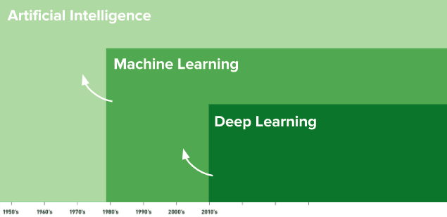
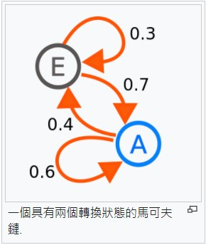
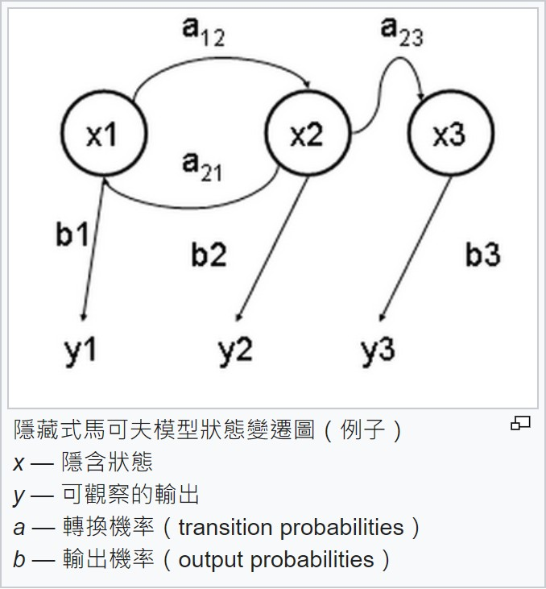
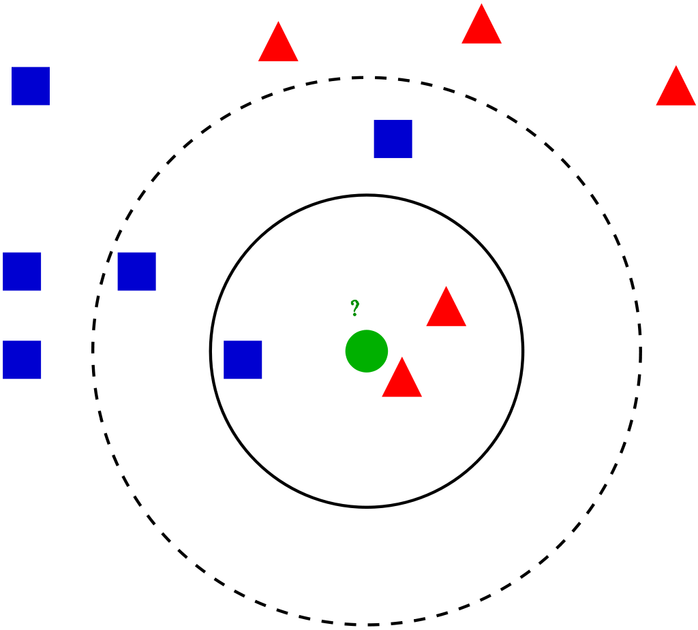

# 機器學習

機器學習(ML)通常透過從過往的資料和經驗中學習並找到其運行規則，最後達到人工智慧。<br>
機器學習包含透過樣本訓練機器辨識出運作模式。這些樣本可以在資料中找到。換句話說，機器學習是一種弱人工智慧(narrow AI)，它從資料中得到複雜的函數(或樣本)來學習以創造演算法(或一組規則)，並利用它來做預測。<br>
機器學習是透過以下的方式去進行訓練如何預測未來：<br>
1. 它需要資料(去訓練系統)
2. 從資料中學習樣本
3. 根據步驟2所獲得的經驗，替未曾見過的新資料做分類，並推測它可能是什麼

# 蒙地卡羅法
## 基本概念
蒙地卡羅方法可以粗略地分成兩類：<br>
1. 所求解的問題本身具有內在的隨機性，藉助電腦的運算能力可以直接類比這種隨機的過程。
2. 所求解問題可以轉化為某種隨機分布的特徵數，比如隨機事件出現的機率，或者隨機變數的期望值。
## 工作過程
<br>
在解決實際問題的時候應用蒙地卡羅方法主要有兩部分工作：<br>
1. 用蒙地卡羅方法類比某一過程時，需要產生各種機率分布的隨機變數。
2. 用統計方法把模型的數字特徵估計出來，從而得到實際問題的數值解。
## 程式實作
[monteCarloPi.py](monteCarloPi.py)
```
執行結果:
C:\Users\user\Desktop\ai\ai109b\筆記\0610>python monteCarloPi.py
MonteCarloPi(100000)= 3.14228
```
# 馬可夫鏈
<br>
為狀態空間中經過從一個狀態到另一個狀態的轉換的隨機過程。<br>
該過程要求具備「無記憶」的性質：下一狀態的機率分布只能由當前狀態決定，在時間序列中它前面的事件均與之無關。<br>
# 隱藏式馬可夫模型
<br>
用來描述一個含有隱含未知參數的馬可夫過程。<br>
其難點是從可觀察的參數中確定該過程的隱含參數。然後利用這些參數來作進一步的分析，例如圖型識別。<br>
# 維特比演算法
一種動態規劃演算法。<br>
用於尋找最有可能產生觀測事件序列的維特比路徑——隱含狀態序列，特別是在馬可夫資訊源上下文和隱藏式馬可夫模型中。<br>
<br>
## 程式實作
[viterbi.py](viterbi.py)
```
執行結果:
C:\Users\user\Desktop\ai\ai109b\筆記\0610>python viterbi.py     
觀察到的序列= ['喵', '喵', '汪']
T= [{}, {}, {}, {}]
t=1 path={'N': ['V', 'N'], 'V': ['N', 'V']}
t=2 path={'N': ['N', 'V', 'N'], 'V': ['V', 'N', 'V']}
T= [{'N': 0.24, 'V': 0.2}, {'N': 0.06400000000000002, 'V': 0.08399999999999999}, {'N': 0.040319999999999995, 'V': 0.022400000000000003}, {}]
prob=0.040319999999999995 path=['N', 'V', 'N']＝最可能的隱序列
```
# EM演算法
在統計中被用於尋找，依賴於不可觀察的隱性變量的概率模型中，參數的最大似然估計。<br>
最大期望算法:<br>
```
1. 初始化分布參數
2. 重複直到收斂：
    1. E步驟：根據參數的假設值，給出未知變量的期望估計，應用於缺失值。
    2. M步驟：根據未知變量的估計值，給出當前的參數的極大似然估計。
```
## 程式實作
[em.py](em.py)
```
執行結果:
C:\Users\user\Desktop\ai\ai109b\筆記\0610>python em.py      
pA=[0.6, 0.4] pB=[0.5, 0.5] delta=9.9999
pA=[0.71301224 0.28698776] pB=[0.58133931 0.41866069] delta=0.11301223540051619
pA=[0.74529204 0.25470796] pB=[0.56925575 0.43074425] delta=0.0322798006814784
pA=[0.76809883 0.23190117] pB=[0.54953591 0.45046409] delta=0.022806798285326613
pA=[0.78316458 0.21683542] pB=[0.53461745 0.46538255] delta=0.015065749932652417
pA=[0.79105525 0.20894475] pB=[0.52628117 0.47371883] delta=0.008336287117588381
pA=[0.79453254 0.20546746] pB=[0.52239044 0.47760956] delta=0.003890729512057156
pA=[0.79592867 0.20407133] pB=[0.52072988 0.47927012] delta=0.001660559431849007
```
# K-近鄰演算法
在圖型識別領域中，最近鄰居法（KNN演算法，又譯K-近鄰演算法）是一種用於分類和迴歸的無母數統計方法。
<br>
# 決策樹
決策樹（Decision tree）由一個決策圖和可能的結果（包括資源成本和風險）組成， 用來創建到達目標的規劃。<br>
決策樹建立並用來輔助決策，是一種特殊的樹結構。決策樹利用像樹一樣的圖形或決策模型的決策支持工具，包括隨機事件結果，資源代價和實用性。<br>
決策樹經常在運籌學中使用，特別是在決策分析中，它幫助確定一個能最可能達到目標的策略。如果在實際中，決策不得不在沒有完備知識的情況下被在線採用，一個決策樹應該平行概率模型作為最佳的選擇模型或在線選擇模型算法。<br>
決策樹的另一個使用是作為計算條件概率的描述性手段。<br>
<br>
一個決策樹包含三種類型的節點：<br>
1. 決策節點：通常用矩形框來表示
2. 機會節點：通常用圓圈來表示
3. 終結點：通常用三角形來表示
# 參考資料
1. [人工智慧、機器學習、深度學習是什麼? – Machine Learning 教學系列 (一)](https://blog.gcp.expert/ml-1-ai-ml-deep-learning-intro/)
2. [蒙地卡羅方法- 維基百科，自由的百科全書 - Wikipedia](https://zh.wikipedia.org/wiki/%E8%92%99%E5%9C%B0%E5%8D%A1%E7%BE%85%E6%96%B9%E6%B3%95)
3. [馬可夫鏈- 維基百科，自由的百科全書 - Wikipedia](https://zh.wikipedia.org/wiki/%E9%A9%AC%E5%B0%94%E5%8F%AF%E5%A4%AB%E9%93%BE)
4. [隱藏式馬可夫模型- 維基百科，自由的百科全書 - Wikipedia](https://zh.wikipedia.org/zh-tw/%E9%9A%90%E9%A9%AC%E5%B0%94%E5%8F%AF%E5%A4%AB%E6%A8%A1%E5%9E%8B)
5. [維特比演算法- 維基百科，自由的百科全書 - Wikipedia](https://zh.wikipedia.org/wiki/%E7%BB%B4%E7%89%B9%E6%AF%94%E7%AE%97%E6%B3%95)
6. [最大期望算法- 維基百科，自由的百科全書 - Wikipedia](https://zh.wikipedia.org/wiki/%E6%9C%80%E5%A4%A7%E6%9C%9F%E6%9C%9B%E7%AE%97%E6%B3%95)
7. [決策樹- 維基百科，自由的百科全書 - Wikipedia](https://zh.wikipedia.org/wiki/%E5%86%B3%E7%AD%96%E6%A0%91)